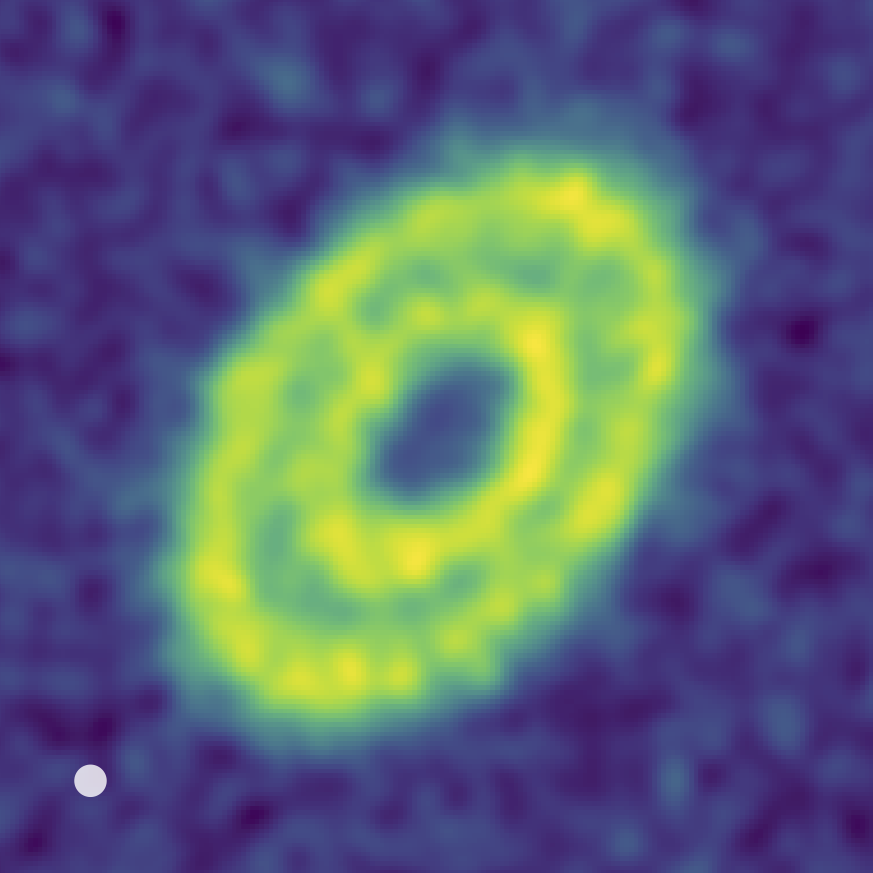
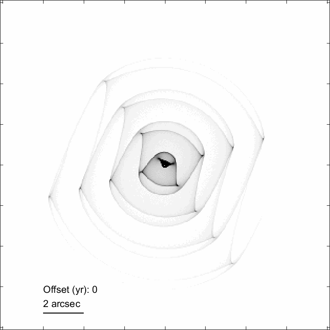

## Home page

Welcome to my research home page, which outlines some of my research interests and recent projects. 

I work primarily on planetary astrophysics. Current topics of interest mostly work towards understanding the past and ongoing evolution of planetary systems like our Solar System and around other stars, and how stars eject dust towards the end of their evolution and replenish material in their neighbourhood, which may go on to form and influence a new generation of stars and planets. You are welcome to explore this website and [read more](./science) about my work. 

Both planetary systems and stars can create dusty environments due to a range of astrophysical processes, which we can [image](./press) with observatories that offer sufficiently high spatial resolution and sensitivity at the appropriate wavelength. You can read more about how we interpret these images in corresponding publications available for download [here](./publications). 

<!-- Students who are interested in [collaborating](./people) are welcome to get in touch. -->

    
    
    

  

## News

[Feb 2026] [NRAO](https://public.nrao.edu/news/a-quintillion-to-one-giant-stars-tiny-dust/) press release on *very* tiny dust grains probed by JWST and ALMA, from Donglin Wu's summer research

[Jan 2026] A big fluffy doughnut...[of planetesimals](./pages/gam-oph-jwst)

[Jan 2026] Debris disks at high resolution -- [ARKS](https://arkslp.org) results now available! See press releases from [NRAO](https://public.nrao.edu/news/alma-teenage-new-worlds/), [Caltech](https://www.caltech.edu/about/news/dusty-disks-around-stars-reveal-diversity-of-planetary-systems-in-their-teenage-years).

[Nov 2025] [Astronomy Picture of the Day](https://apod.nasa.gov/apod/ap251124.html)

[Nov 2025] Beautiful spiral dust shells [imaged](./pages/apep-jwst) by JWST -- see [press page](./press) for details!

<!-- [Oct 2024] I have moved to Caltech. Please use my updated [contact details](./about) if you would like to get in touch. -->

