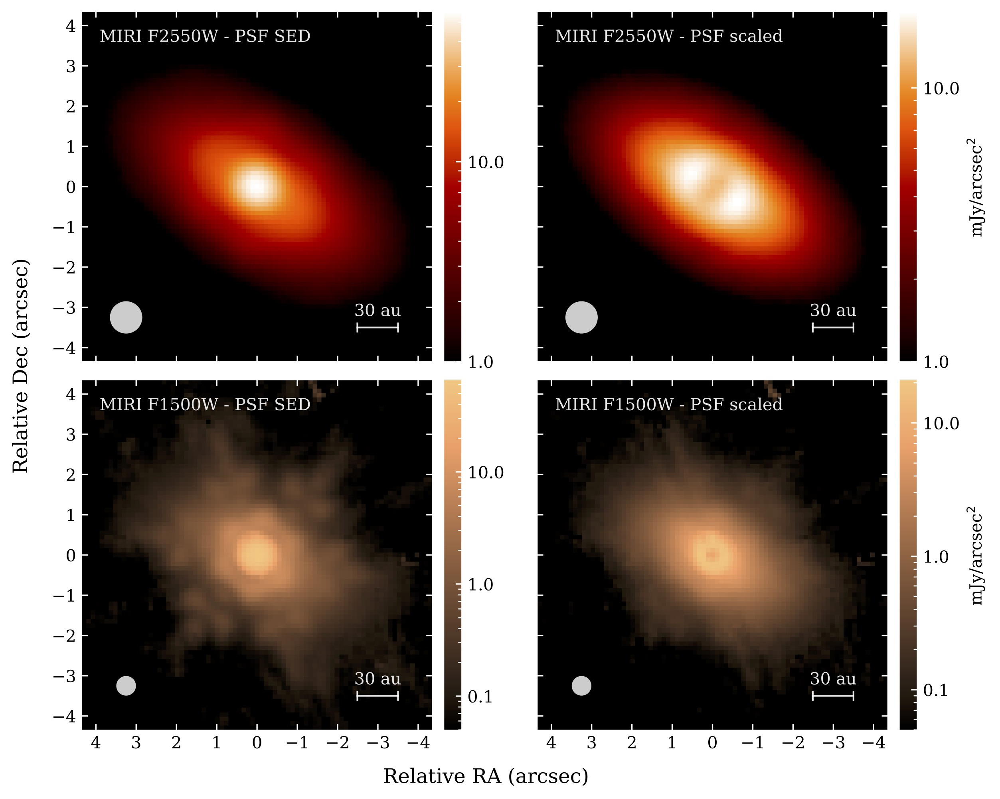

## JWST images of γ Oph

Images are taken with JWST/MIRI at 15 and 25.5 microns. 
Comparison with [ALMA imaging](https://arkslp.org) suggests there are likely planetesimals out to 250 au. 
The reference is [Han et al., submitted](../publications/Han-2026b.pdf). 

    

