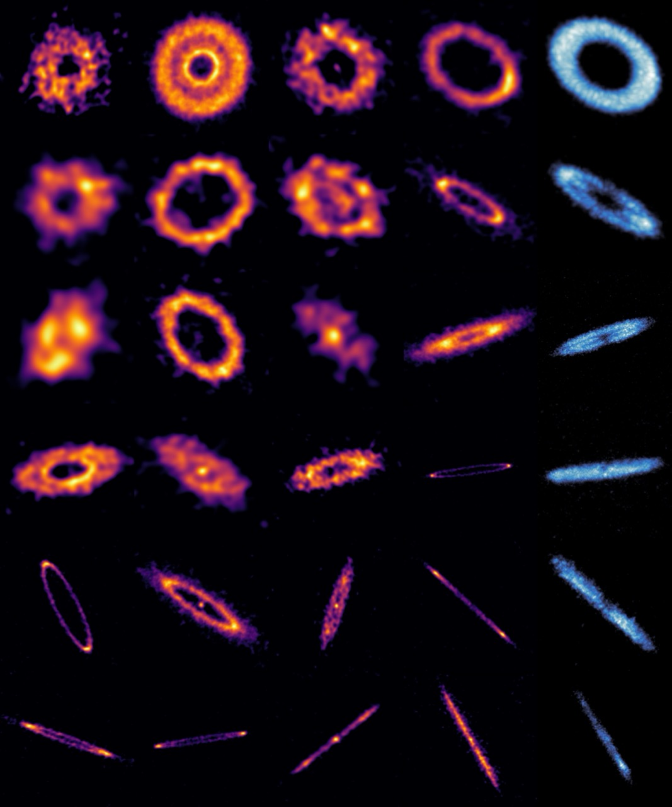
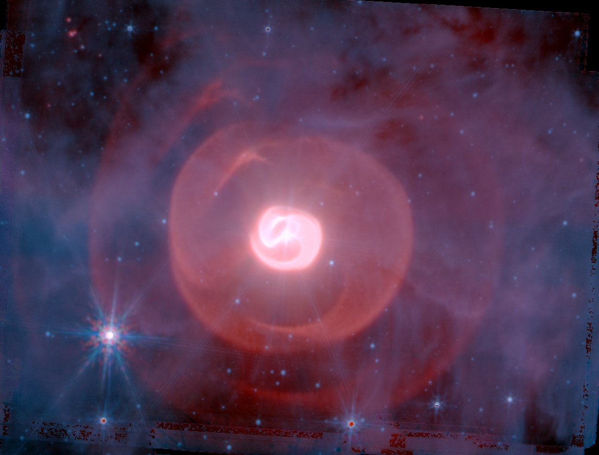
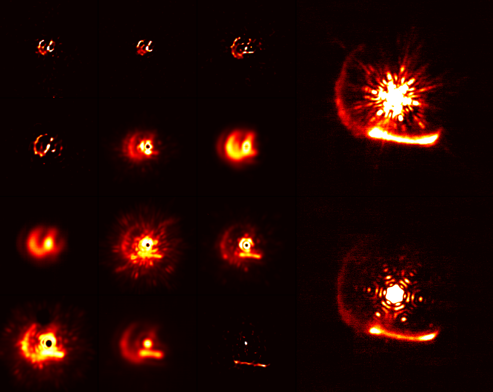
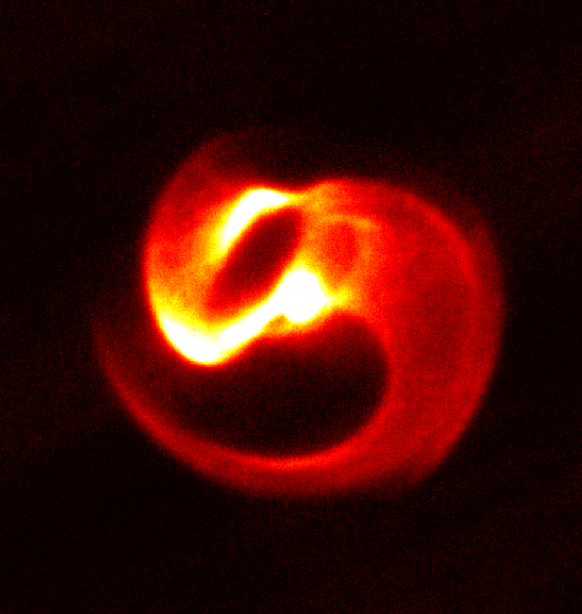

## Press

### [Jan 2026] Press release: [Extrasolar comet belts imaged at unprecedented detail](https://public.nrao.edu/news/alma-teenage-new-worlds/)
<figure class="float-left" style="width: 240px; margin-bottom: 10px;">
    
    <figcaption style="text-align: center;">Sebastian Marino, Sorcha Mac Manamon, ARKS collaboration</figcaption>
</figure>

Planetary systems like our Solar System form from dense rotating disks of gas and dust, in which microscopic particles of dust snowball into asteroids, comets and planets over millions of years. Unlike planets that live geographically solitary lives by clearing their own orbits, asteroids and comets live in belts. In our Solar System, we see them in the asteroid belt just beyond the terrestrial planets, and in the even more massive Kuiper belt beyond Neptune. As these bodies within the belt collide with each other over the next billions of years, dust that is released re-populates a disk that may become bright enough for our telescopes to observe. These belts are known as debris disks, the collection of comet-sized bodies and their dust and gas in a planetary system, and the successor disks of the younger protoplanetary disks. 

In the ARKS collaboration, we recently used the [Atacama Large Millimeter Array](https://www.almaobservatory.org/en/home/) in the Atacama desert of Chile to systematically image 24 of these extrasolar comet belts for the first time at an exceptional level of detail. These alien comet belts show a range of configurations, from eerily narrow rings to multiple concentric circles to wide and fluffy doughnuts. We think that these geometries are records of diverse histories among these planetary systems, in which planets and comets tug each other with gravity, celestial bodies reshape each others' orbits and comets smash into each other. Read more from press releases by Caltech, [NRAO](https://public.nrao.edu/news/alma-teenage-new-worlds/) and [ALMA](https://www.almaobservatory.org/en/audiences/alma-reveals-teenage-years-of-new-worlds/).

  

### [Nov 2025] Press release: [JWST images seven centuries of stellar dust arranged in beautiful nested spirals](https://science.nasa.gov/missions/webb/webb-first-to-show-4-dust-shells-spiraling-apep-limits-long-orbit/)

Apep consists of two massive stars orbiting each other on a highly elliptical orbit. 
<!-- Both stars belong to a rare class of objects known as Wolf-Rayet stars, shedding large amounts of mass in the form of stellar winds. -->
Every two hundred years, they approach each other and spend a few decades in such proximity that their powerful stellar winds collide, launching fireworks of dust that bloom and grow in slow motion in the infrared night sky. 
This was precisely what the [James Webb Space Telescope](https://science.nasa.gov/mission/webb/) recently captured, except the telescope's infrared vision was so sharp that it could see the fading flecks of light from the past seven centuries of this spectacle that would otherwise have dissolved into darkness. 

<figure class="float-left" style="width: 240px; margin-bottom: 10px;">
    <iframe width="240" height="150" src="https://www.youtube.com/embed/fITdexBNfkQ" class="left-pic"> </iframe>
    <figcaption style="text-align: center;">Christian Nieves, Alyssa Pagan (STScI); NASA, ESA, CSA, STScI</figcaption>
</figure>

Using these images, we were able to trace how these sparks of dust cool as they fade, which turns out to be in line very small particles of carbon. A third star punches a hole through the otherwise regular spiral dust surface. 
While rare, Wolf-Rayet stars are a major carbon dust producer and can significantly reshape their environment. The impact of their chemical and thermal reach on the dust and gas content of galaxies and the formation of a new generation of stars and planets are active topics of investigation. 

You can read more from press releases by [NASA](https://science.nasa.gov/missions/webb/webb-first-to-show-4-dust-shells-spiraling-apep-limits-long-orbit/), [Caltech](https://www.caltech.edu/about/news/rare-star-system-gives-insights-into-the-origins-of-carbon-dust-in-the-galaxy) and [Macquarie University](https://lighthouse.mq.edu.au/article/november-2025/apeps-sting-macquarie-student-helps-unlock-mysteries-of-dying-stars-deadly-embrace). The colour image is available [here](./pages/apep-jwst), which was also featured on [Astronomy Picture of the Day](https://apod.nasa.gov/apod/ap251124.html). 

  

### [May 2025] Podcast: [What can astronomy tell us about our place in the universe](https://www.gatescambridge.org/about/news/what-can-astronomy-tell-us-about-our-place-in-the-universe/)
<!-- <iframe width="240" height="240" src="https://www.youtube.com/embed/t3Uqhi4gF_c" class="left-pic"> </iframe> -->

<!-- A chat with Gates Cambridge on topics related to astronomy and its historical and social context. -->
<!--   
  
  
  
   -->
  

### [Oct 2022] Press release: [The expanding dust shell of WR140](https://www.cam.ac.uk/stories/dust-plumes-pushed-by-star)

Light carries momentum that can push matter. Smaller solid particles such as dust are more strongly affected by this effect, however it is difficult to directly measure the trajectory of individual particles of dust and study how it could be affected by radiation pressure. We recently analysed close to two decades of high-resolution images of dust produced in WR140. Due to the interesting geometry in which dust in these systems form, we were able to accurately track the motion of individual dust features, which suggested that they were radially expanding away from the extremely luminous central stars. This allows us to better measure quantities like the efficiency with which momentum is exchanged between light and dust particles, as well as how much hidden gas might exist alongside the dust, which in turns tells us how efficiently mass ejected from these stars is able to form dust. 

Simultaneous to the study was the delivery of images obtained by the James Webb Space Telescope of the same dust shells, which revealed not one but 20 concentric dust shells, which despite the complex geometry was closely described by our model. Read more about both studies from the University of Cambridge [press release](https://www.cam.ac.uk/stories/dust-plumes-pushed-by-star) and reports from the [ABC](https://www.abc.net.au/news/science/2022-10-13/james-webb-space-telescope-image-wr140-dust-shells/101511786), [BBC](https://www.bbc.co.uk/news/science-environment-63234027), [CNN](https://edition.cnn.com/2022/10/12/world/webb-dust-rings-stellar-pair-scn/index.html) and [The Guardian](https://www.theguardian.com/science/2022/oct/12/james-webb-space-telescope-cosmic-fingerprint-dust-rings-wolf-rayet-140). 
  

### [Oct 2020] Press release: [The Wolf-Rayet binary Apep](https://www.sydney.edu.au/news-opinion/news/2020/10/12/Wolf-Rayet-binary-apep-in-the-eye-of-stellar-cyclone.html)

The most massive of stars end their evolution in a supernova explosion. In the lead-up to it, they enter a Wolf-Rayet phase, during which they release a very large amount of mass as dust, sometimes in the form of intricately shaped spirals. We imaged a rare example of such a spiral over 3 years, precisely measuring the speed at which the dust spiral expands away from the star. We were also able to use very high resolution imaging methods to resolve the two stars at the core of this dust-generating engine, allowing us to construct a model that links the inner orbit of the stars with the outer shape of the dust which they create. This [video](https://www.youtube.com/watch?v=eH7x45BkQdM&feature=youtu.be) visualises the model. Read more from the University of Sydney [press release](https://www.sydney.edu.au/news-opinion/news/2020/10/12/Wolf-Rayet-binary-apep-in-the-eye-of-stellar-cyclone.html), [CNN](https://us.cnn.com/2020/10/12/world/wolf-rayet-star-apep-scn-trnd/index.html) and [The Conversation](https://theconversation.com/this-mysterious-exotic-stellar-peacock-may-open-the-door-to-a-realm-of-physics-only-ever-glimpsed-147911). 
